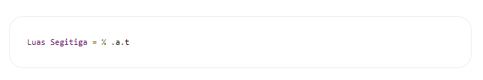

## Contoh Program Java Menghitung Luas Segitiga 

# 1. Rumus Menghitung Luas Segitiga 

 

# Keterangan: 

a = Alas segitiga 

t = Tinggi segitiga 

Alas merupakan salah satu sisi segitiga, sedangkan tinggi adalah jarak ke titik tertinggi dalam segitiga. Pada program ini diasumsikan kita sudah mengetahui alas dan tinggi segitiga sehingga kita hanya perlu mencari nilai luas segitiga dari kedua variabel yang sudah diketahui. 

# Algoritma 

Berikut ini adalah algoritma untuk menghitung luas segitiga: 

<li> Mulai </li> 

<li> Masukan alas segitiga </li> 

<li> Masukan tinggi segitiga </li> 

<li> Hitung luas segitiga = (0.5*(alas*tinggi)); </li> 

<li> Tampilkan luas segitiga </li> 

<li> Selesai </li> 

