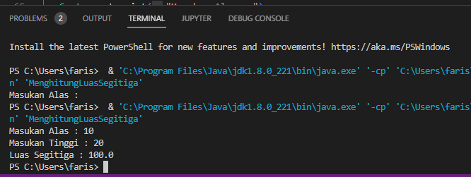

## Contoh Program Java Menghitung Luas Segitiga </p>
# 1. Rumus Menghitung Luas Segitiga </p>
 </p>
# Keterangan: </p>
a = Alas segitiga </p>
t = Tinggi segitiga </p>

Alas merupakan salah satu sisi segitiga, sedangkan tinggi adalah jarak ke titik tertinggi dalam segitiga. Pada program ini diasumsikan kita sudah mengetahui alas dan tinggi segitiga sehingga kita hanya perlu mencari nilai luas segitiga dari kedua variabel yang sudah diketahui. </p>

# Algoritma </p>
Berikut ini adalah algoritma untuk menghitung luas segitiga: </p>

<li> Mulai </li> </p>
<li> Masukan alas segitiga </li> </p>
<li> Masukan tinggi segitiga </li> </p>
<li> Hitung luas segitiga = (0.5*(alas*tinggi)); </li> </p>
<li> Tampilkan luas segitiga </li> </p>
<li> Selesai </li> </p>

## Implementasi Kedalam Program Java </p>
Program ini saya membuat dengan aplikasi netbeans. Aplikasi ini memang sangat dikhususkan untuk pemograman java karena sudah mendukung pengembangan aplikasi berbasis GUI. Selain aplikasi ini ada beberapa aplikasi teks editor yang bisa kalian gunakan seperti notepad, textpad ataupun visual studio code namun harus disertai dengan installer JDK agar mendukung kompilasi code program. </p>

```java
import java.util.Scanner;

/*
 * Click nbfs://nbhost/SystemFileSystem/Templates/Licenses/license-default.txt to change this license
 * Click nbfs://nbhost/SystemFileSystem/Templates/Other/File.java to edit this template
 */

/**
 *
 * @author faris
 */

// Nama     : Faris Syahluthfi
// NIM      : 312010034
// Kelas    : TI.20.A1

// Class
public class MenghitungLuasSegitiga{
  public double  alas;
  public double  tinggi;
  public double  luas;

// Construktur
  public MenghitungLuasSegitiga(double  alas, double  tinggi, double luas){
     System.out.println ("Menghitung luas Segitiga");
     this.alas = alas;
     this.tinggi = tinggi;
     this.luas = luas;
}

//ini method setter

   public void setAlas(double  alas){
      this.alas = alas;
}

   public void setTinggi(double  tinggi){
      this.tinggi = tinggi;
}

public void setLuas(double  luas){
   this.luas = luas;
}

 // ini method getter
   public double getAlas (){
      return this.alas; 
}

    public double getTinggi (){
      return this.tinggi; 
}

public double getLuas (){
   return this.luas; 
}


public static void main(String[] args) {
   Scanner input=new Scanner(System.in);
   int a, t;
   double luas;
   
   System.out.print("Masukan Alas : ");
   a=input.nextInt();
   System.out.print("Masukan Tinggi : ");
   t=input.nextInt();
   
   luas=0.5*a*t;
   System.out.println("Luas Segitiga : "+luas);
}  
}


``` 
</p>

# Penjelasan:
Program ini berjalan secara sekuensial tanpa menggunakan fungsi percabangan atau perulangan, dimana program akan mengeksekusi kode baris per baris dari atas kebawah. Program ini akan menerima input secara langsung dari user saat program berjalan. Sehingga kita membutuhkan class scanner yang sudah disediakan oleh java, untuk menggunakannya kita menulis sintak import java.util.Scanner; pada awal baris program nantinya didalam fungsi main() kita membuat objek baru dengan nama input yang mengacu pada class scanner tersebut. Ada tiga variabel yang akan kita gunakan untuk menampung nilai yaitu variabel a dan t dengan tipe integer (bilangan bulat) dan variabel luas dengan tipe double (bilangan desimal). </p>
Pengguna akan memasukan nilai alas segitiga yang nilainya akan ditampung pada variabel a dan tinggi untuk variabel t. Selanjutnya akan dihitung luas segitiga bedasarkan rumus diatas yaitu luas=0.5*a*t; Kemudian pada sintak beris terakhir kita mencetak hasil dari perhitungan rumus luas segitiga tersebut. </p>

Ini adalah output program yang sudah saya run: </p>



